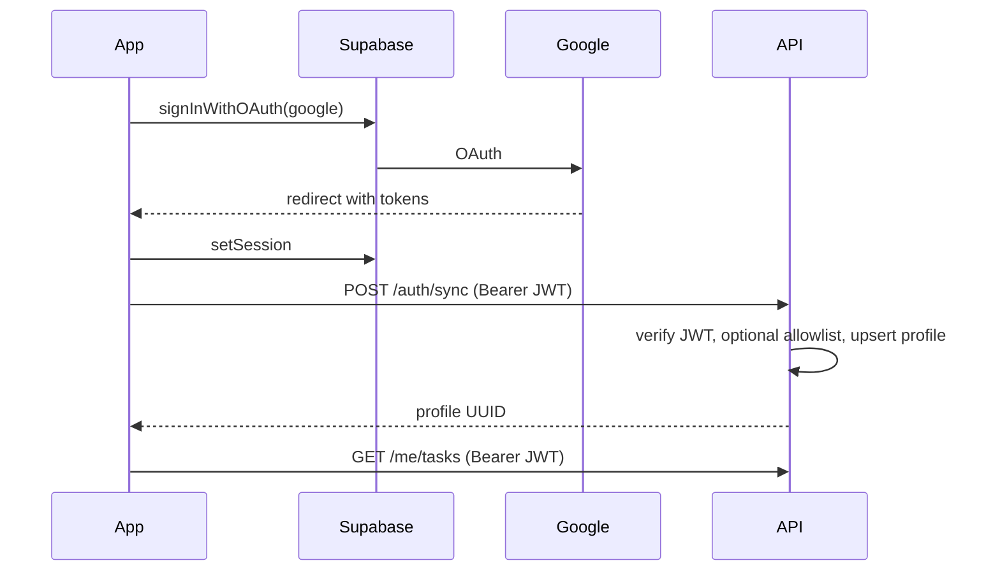

# Ike — Supabase Google Auth setup

Ike uses **Supabase Auth** for Google OAuth only. The FastAPI backend verifies Supabase JWTs and stores app data in `profiles` + `tasks` (no custom password auth).

## 1. Supabase project

1. Create or open your project at [supabase.com/dashboard](https://supabase.com/dashboard).
2. **Settings → API** — copy:
   - **Project URL** → `EXPO_PUBLIC_SUPABASE_URL` (frontend) and `SUPABASE_URL` (backend)
   - **anon / publishable key** → `EXPO_PUBLIC_SUPABASE_ANON_KEY`
   - **Legacy JWT Secret** → backend `SUPABASE_JWT_SECRET` (HS256 only; newer projects use ES256 via JWKS)

## 2. Google Cloud OAuth

1. [Google Cloud Console](https://console.cloud.google.com/) → APIs & Services → Credentials.
2. Create **OAuth 2.0 Client ID** (Web application).
3. **Authorized redirect URIs** — add **both**:
   - Supabase callback: `https://YOUR_PROJECT_REF.supabase.co/auth/v1/callback`
   - Expo dev (shown on login screen in `__DEV__`): typically `ike://auth/callback` or `exp://…` — copy from the app’s dev hint after `npx expo start`.
4. Copy **Client ID** and **Client secret** into Supabase:
   - **Authentication → Providers → Google** → Enable, paste credentials.

## 3. Supabase redirect URLs

**Authentication → URL Configuration**:

| Field | Value |
|--------|--------|
| Site URL | `ike://` (or your production deep link) |
| Redirect URLs | `ike://auth/callback`, `exp://**`, `http://localhost:**` (for Expo Go) |

Add every redirect URI your dev build prints (Expo Go vs dev client vs production).

## 4. Database migration

Run in the SQL Editor (in order):

1. `supabase/migrations/001_auth_profiles.sql` — `profiles`, `allowed_emails`, `tasks.profile_id`, trigger on `auth.users`
2. `supabase/migrations/002_user_category_resistance.sql` — adaptive category resistance

### Optional sign-in allowlist

By default, sign-in is **open** for any Google account on your Supabase project. To restrict access:

```sql
INSERT INTO public.allowed_emails (email) VALUES ('you@gmail.com')
ON CONFLICT DO NOTHING;
```

Or set backend env `ALLOWED_EMAILS=you@gmail.com,friend@gmail.com`.

## 5. Environment variables

### Backend (repo root `.env`)

```env
DATABASE_URL=postgresql://...pooler.supabase.com:5432/postgres
SUPABASE_URL=https://YOUR_PROJECT_REF.supabase.co
SUPABASE_JWT_SECRET=your-legacy-jwt-secret
# Optional allowlist:
# ALLOWED_EMAILS=you@gmail.com
```

### Frontend (`frontend/.env`)

```env
EXPO_PUBLIC_SUPABASE_URL=https://YOUR_PROJECT_REF.supabase.co
EXPO_PUBLIC_SUPABASE_ANON_KEY=your-anon-key

EXPO_PUBLIC_API_BASE_URL=http://YOUR_LAN_IP:8000
```

Restart Metro after changing `.env`: `npx expo start -c`.

## 6. Run locally

```bash
# Terminal 1 — API (repo root)
source venv/bin/activate
pip install -r requirements.txt
uvicorn app.main:app --reload --host 0.0.0.0 --port 8000

# Terminal 2 — mobile
cd frontend
npm install
npx expo start
```

## 7. Auth flow



## 8. API routes (authenticated)

| Method | Path | Description |
|--------|------|-------------|
| POST | `/auth/sync` | After login — create profile |
| GET | `/auth/me` | Current profile |
| GET | `/me/tasks` | Active tasks |
| POST | `/me/tasks` | Create task |
| GET | `/me/priority-landscape` | Landscape plan |
| GET/PATCH/DELETE | `/tasks/{id}` | Single task (ownership enforced) |

Legacy integer `user_id` routes remain for old test data but are deprecated.

## 9. File map

```
frontend/src/
  services/supabase.ts    # Supabase client + AsyncStorage session
  services/auth.ts        # Google OAuth (expo-web-browser)
  hooks/useAuth.tsx       # Session + profile sync + AuthGate
  screens/LoginScreen.tsx
  components/LoginButton.tsx
  api/authApi.ts          # /auth/sync

app/
  auth/jwt.py             # Verify Supabase JWT (HS256 + ES256 via JWKS)
  auth/dependencies.py    # Bearer → Profile
  models/profile_model.py
  routers/auth_router.py
  routers/me_router.py
  services/access_service.py  # Optional sign-in allowlist
```
