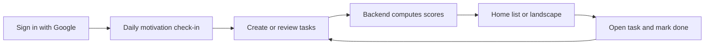

# Ike — Product Post-Mortem

## 1. Product Overview

**Product:** Ike
**Type:** Task prioritisation / planning application
**Status:** Discontinued / archived
**Repository:** Public GitHub repository

### One-line description

> Ike is a task-prioritisation application designed to transform a list of tasks into a visual action plan by continuously ranking tasks according to their urgency, importance and required effort.

---

# 2. The Problem

## 2.1 The problem I observed

The idea for Ike originated from a problem I repeatedly encountered during both my studies and professional experiences: **how to decide where to focus limited time and energy when multiple tasks compete for attention.**

During my studies, I frequently had to manage several courses, projects, assignments and deadlines simultaneously. The challenge was not necessarily identifying what needed to be done, but determining **which task deserved my attention first**.

During my internship, I realised that the same underlying problem existed in a professional context.

For example:

- Which business opportunity should the sales team focus on?
- Which invoice should the accountant process first?
- When should the company replenish equipment stocks?
- Which maintenance intervention is becoming urgent?
- Which project deserves additional resources?

Although these situations are very different operationally, I identified a common underlying problem:

> **When resources are limited, how should we prioritise competing tasks?**

I therefore started thinking about prioritisation as a problem that could potentially be addressed with a general-purpose tool.

---


# 3. Initial Product Hypothesis

My initial hypothesis was that many prioritisation problems could be represented using a small number of dimensions.

I started from the **Eisenhower Matrix**, which classifies tasks according to:

- Importance
- Urgency

However, I identified two limitations with the traditional binary representation.

### 3.1 Importance and urgency are continuous

In practice, tasks are rarely simply "important" or "not important".

A task can be:

- slightly important,
- moderately important,
- very important.

The same applies to urgency.

If a task is on someone's task list, it generally has at least some reason to be there. Treating importance and urgency as binary variables therefore seemed overly restrictive.

### 3.2 Prioritisation should produce an actionable plan

A traditional Eisenhower Matrix helps classify tasks, but classification is not necessarily the same thing as planning.

Two tasks can have identical importance and urgency while requiring completely different amounts of effort.

For example:

> Task A: 10 minutes
> Task B: 8 hours

Both may be equally urgent and important, but they should not necessarily be approached in the same way.

I therefore introduced **effort** as a third dimension.

---


# 4. The Ike Concept

The central idea behind Ike was to transform the traditional Eisenhower Matrix into a **continuous, visual prioritisation system**.

Instead of a binary classification, tasks are positioned according to continuous values.

### Dimensions

**X-axis:** Effort required

**Y-axis:** Priority

Where:

> **Priority = f(Urgency, Importance)**

with priority increasing as both urgency and importance increase.

The resulting visualisation was intended to transform a conventional task list into something closer to a **dynamic action plan**.

---


# 5. Target Users


## Original target

The initial ambition was to create a **universal prioritisation tool** that could be used by:

- Students
- Professionals
- Individuals
- Teams
- Businesses

The underlying assumption was that prioritisation is sufficiently universal that the same product could address these different contexts.

### Student use cases

Examples:

- Deciding which assignment to work on
- Balancing several courses
- Prioritising revision
- Managing projects
- Deciding what to do next


### Professional use cases

Examples:

- Sales opportunity prioritisation
- Invoice processing
- Stock replenishment
- Maintenance scheduling
- Project prioritisation

---


# 6. User Problem vs. Product Solution


| User problem                                | Ike's proposed solution          |
| ------------------------------------------- | -------------------------------- |
| Too many competing tasks                    | Visual prioritisation            |
| Difficulty deciding what to do first        | Continuous priority score        |
| Importance is not binary                    | Continuous importance            |
| Urgency is not binary                       | Continuous urgency               |
| Tasks require different amounts of work     | Effort dimension                 |
| A task list doesn't provide enough guidance | Convert tasks into a visual plan |


---


# 7. Product Design

How Ike was meant to be used — from first login to daily execution.  
For the technical scoring pipeline, see [main-process.md](./main-process.md) and [priority-landscape.md](./priority-landscape.md).

## 7.1 Core user flow



**Typical session:**

1. **Authenticate** — Google OAuth via Supabase; backend syncs a `profile` on first login.
2. **Check in (optional)** — once per session, a 1–10 slider asks how the user feels; this nudges landscape recommendations (Quick wins vs Big rocks).
3. **Capture tasks** — name, category, importance, urgency; effort is optional (advanced). Urgency growth rate is fixed in the UI (0.1/day) and not exposed to the user.
4. **Let time work** — urgency rises each day; effort rises slowly and is modulated by hidden category resistance.
5. **Decide** — Home shows a single priority-sorted list with a **Focus** badge on the top 3; the landscape shows all active tasks as animated dots.
6. **Act** — open a task, mark it done; completing a task lowers resistance for that category on future tasks.

Nothing is recalculated in the background between sessions — scores refresh whenever the app loads tasks from the API.

## 7.2 Screens and navigation

| Screen | Role |
|--------|------|
| **Login** | Google sign-in only |
| **Home** | Sorted task list, create CTA, link to landscape |
| **Create / Edit task** | Sliders + presets (Low / Med / High, Later / Soon / Today) |
| **Task detail** | Mark done first, compact metrics, edit / delete |
| **Priority landscape** | 2D plot, time projection, recommended focus list |

Navigation is a single stack: Home is the hub; create/edit open as modals.

## 7.3 Task model

### What the user provides (stored)

| Field | Range | Role |
|-------|-------|------|
| **Name** | text | Task label |
| **Category** | admin, work, study, sport, personal, health | Groups tasks; drives adaptive resistance |
| **Importance** | 0–10 | Fixed weight in the priority formula |
| **Initial urgency** | 0–10 | Starting urgency at creation |
| **Initial effort** | 0–10 | Starting effort estimate (optional in UI) |
| **Urgency growth rate** | ≥ 0 | How fast urgency rises per day (default 0.1 in app, 0.5 in API default) |

### What the system computes (never stored)

| Field | How |
|-------|-----|
| **current_urgency** | `min(10, initial_urgency + growth_rate × days)` |
| **priority_score** | `importance × current_urgency` (0–100) |
| **priority_level** | low / medium / high / critical from score thresholds |
| **current_effort** | `min(10, initial_effort + resistance × √days)` |
| **Landscape position** | x = effort, y = normalized priority (`score / 10`) |
| **Quadrant** | 2×2 split at 5.0 on both axes |

### Hidden variable

**Category resistance** — per user and category, learned from completions and inactivity. It increases perceived effort over time when a category is neglected, and decreases when tasks in that category are completed. The user never sees or edits this value.

## 7.4 The 2D landscape

The main visual differentiator: a **dynamic action plan**, not a static Eisenhower grid.

| Axis | Meaning |
|------|---------|
| **X — Effort** | How costly the task feels right now (0–10) |
| **Y — Priority** | Normalised score from importance × urgency (0–10) |

**Quadrants** (threshold 5.0 on each axis):

| Quadrant | Effort | Priority | Intent |
|----------|--------|----------|--------|
| Quick wins | low | high | Do first when energy is low |
| Big rocks | high | high | Schedule when motivated |
| Nice to do | low | low | Backlog |
| Postpone / delegate | high | low | Defer or hand off |

**Time projection:** the user can preview Today, +7 days, or +30 days. Dots animate to where tasks would land if urgency (and effort) continued to grow — no data is written to the database.

**Colour coding:** dot colour reflects `priority_level` (green → red), independent of quadrant.

See [task-landscape-quadrants.png](./task-landscape-quadrants.png) for the conceptual map and [screenshot-task-landscape.png](./screenshot-task-landscape.png) for the shipped UI.

## 7.5 Interaction design choices

Design evolved toward **lower cognitive load** in the final iteration:

* **Sliders and presets** instead of raw 0–10 number fields
* **Human-readable labels** on task cards (“High urgency · Medium effort”) instead of raw scores
* **Growth rate hidden** — one less parameter for the user to reason about
* **Resistance hidden** — adaptive behaviour without explaining the model
* **Focus badge** on the top 3 tasks instead of duplicating lists
* **Motivation slider** — optional daily input that shifts recommendations, stored locally only

These choices reflect the lesson in §10.2: the underlying model had many moving parts; the UI tried to surface fewer of them.

## 7.6 Product philosophy

The product was based on four principles:

1. **Prioritisation is continuous rather than binary** — importance and urgency are 0–10 scales, not four fixed buckets.
2. **Priority is dynamic** — urgency grows over time, so the plan changes even when the user does nothing.
3. **Effort bridges ranking and action** — two tasks with the same score can sit in different quadrants and deserve different treatment.
4. **The output should be a plan, not a list** — the landscape turns abstract scores into spatial “where should I look first?” guidance.

---


# 8. What I Built

A full-stack mobile application in a monorepo: **FastAPI backend** + **Expo (React Native) frontend**, backed by **Supabase** (Postgres + Google Auth). Priority scores are computed at read time — they are not stored in the database.

## 8.1 Frontend (mobile)


| Layer           | Technology                                                             |
| --------------- | ---------------------------------------------------------------------- |
| Framework       | React Native 0.81 via **Expo SDK 54**                                  |
| Language        | **TypeScript**                                                         |
| Navigation      | React Navigation (native stack)                                        |
| Auth            | Supabase Auth + Google OAuth (`expo-auth-session`, `expo-web-browser`) |
| API client      | Axios (Bearer JWT from Supabase session)                               |
| Session storage | `@react-native-async-storage/async-storage`                            |


**Screens shipped:**


| Screen             | Purpose                                                                 |
| ------------------ | ----------------------------------------------------------------------- |
| Login              | Google sign-in                                                          |
| Home               | Priority-sorted task list, daily motivation prompt                      |
| Create / Edit task | Sliders and presets for importance, urgency, effort                     |
| Task detail        | Mark done, edit, collapsible metrics                                    |
| Priority landscape | Animated 2D plan, time projection (Today / +7d / +30d), recommendations |


**Notable UI features:**

- Animated task dots on the landscape (effort × normalized priority)
- Quadrant labels: Quick wins, Big rocks, Nice to do, Postpone / delegate
- Priority badges (low → critical) from `importance × current_urgency`
- Daily motivation check-in (stored locally only, adjusts recommendations)
- Adaptive category resistance — learned on the backend, hidden from the user

**Build tooling:** EAS Build configured for Android APK (`eas.json`); APK builds were attempted but not fully resolved before the project was archived.

## 8.2 Backend (API)


| Layer      | Technology                                                       |
| ---------- | ---------------------------------------------------------------- |
| Framework  | **FastAPI**                                                      |
| Language   | **Python 3**                                                     |
| ORM        | SQLAlchemy                                                       |
| Validation | Pydantic                                                         |
| Auth       | PyJWT — verifies Supabase tokens (HS256 legacy + ES256 via JWKS) |
| Server     | Uvicorn                                                          |


**Architecture:** routers → services → DAO → SQLAlchemy models (see [backend-architecture.md](./backend-architecture.md)).

**Core services:**

- `TaskService` — CRUD + dynamic scoring (urgency growth, effort, priority level)
- `PriorityLandscapeService` — coordinates, quadrants, motivation-aware recommendations
- `CategoryResistanceService` — per-category effort resistance learned from completions / inactivity
- `ProfileService` + `AccessService` — profile sync after login, optional email allowlist

**Scoring model (computed on every read):**

- `current_urgency = min(10, initial_urgency + growth_rate × days_elapsed)`
- `priority_score = importance × current_urgency` (0–100)
- `current_effort = min(10, initial_effort + resistance × √days_elapsed)`
- Landscape axes: **x = effort**, **y = normalized priority** (`score / 10`)


## 8.3 Database and auth


| Component                  | Role                                                             |
| -------------------------- | ---------------------------------------------------------------- |
| **Supabase Postgres**      | Primary datastore                                                |
| **Supabase Auth**          | Google OAuth; JWT issued to the mobile app                       |
| `profiles`                 | One row per user (UUID = `auth.users.id`)                        |
| `tasks`                    | Task inputs (importance, urgency, effort, category, growth rate) |
| `user_category_resistance` | Adaptive resistance per user × category                          |
| `allowed_emails`           | Optional sign-in allowlist (open by default when empty)          |


SQL migrations live in `supabase/migrations/` (001 profiles + tasks, 002 category resistance).

## 8.4 Repository layout

```text
app/                  FastAPI backend
frontend/             Expo mobile app
supabase/migrations/  SQL schema
docs/                 Architecture diagrams and setup guides
tests/                Backend unit tests (category resistance)
```


## 8.5 Deployment (as built)

- API hosted on **Railway** during active development
- Supabase hosted Postgres + Auth (cloud project)
- Frontend run via **Expo Go** for dev; EAS for standalone Android builds
- Repository prepared for **public GitHub** release (no secrets in tracked files)


## 8.6 Documentation


| Asset                                    | Location                                                         |
| ---------------------------------------- | ---------------------------------------------------------------- |
| Setup guide (OAuth, env vars)            | [AUTH_SETUP.md](./AUTH_SETUP.md)                                 |
| Main process flowchart                   | [main-process.md](./main-process.md)                             |
| Priority landscape (formulas, quadrants) | [priority-landscape.md](./priority-landscape.md)                 |
| Backend UML and API surface              | [backend-architecture.md](./backend-architecture.md)             |
| Conceptual quadrant map                  | [task-landscape-quadrants.png](./task-landscape-quadrants.png)   |
| App screenshot                           | [screenshot-task-landscape.png](./screenshot-task-landscape.png) |
| Docs index                               | [README.md](./README.md)                                         |
| Root README                              | [../README.md](../README.md)                                     |


All diagrams use **Mermaid** except the two PNG visual references above.

---


# 9. What Worked


### 9.1 The underlying problem was real

The problem of prioritisation appeared in multiple contexts and was personally meaningful to me.

### 9.2 The continuous model was more expressive than a binary matrix

The continuous representation allowed tasks to be differentiated rather than forcing them into four categories.

### 9.3 Effort added an important dimension

Adding effort allowed the product to move beyond simple prioritisation towards planning.

### 9.4 The project demonstrated technical feasibility

I was able to turn the conceptual model into a functional application and build the required frontend/backend architecture.

---


# 10. What Didn't Work


## 10.1 The product was too ambitious

The biggest mistake was attempting to create a **universal prioritisation product** for both students and professionals.

Although the underlying problem was similar, the actual contexts were substantially different.

Students and professionals:

- have different workflows,
- have different constraints,
- use different tools,
- have different definitions of urgency and importance,
- and may expect different forms of assistance.

The attempt to serve both groups therefore made the product more complex.

---


## 10.2 The product was difficult to understand

One of the most important lessons came from testing Ike with professionals.

The conceptual model made sense to me because I had developed it around a problem I personally experienced.

However, this did not necessarily translate into immediate user understanding.

The product required users to understand:

1. Importance
2. Urgency
3. Priority
4. Effort
5. The relationship between these variables
6. The resulting visual representation

This created a significant **cognitive load**.

The product was therefore solving a problem that was relatively easy to describe but through a mechanism that was not necessarily intuitive.

---


# 11. The Main Product Lesson

The biggest lesson from Ike was:

> **A broad problem does not necessarily imply a broad product.**

Prioritisation is a universal problem, but the way people prioritise tasks is highly context-dependent.

Trying to create one product for everyone led to a product that was less immediately understandable and potentially less useful for any particular user segment.

A more focused approach would have been to choose a specific initial customer segment and optimise the product around its workflow.

For example:

> **"Ike for university students managing multiple courses and projects."**

would have provided a much clearer product proposition than:

> **"Ike for anyone who needs to prioritise tasks."**

---


# 12. What I Would Do Differently

If I restarted Ike today, I would change the product development process rather than simply improving the implementation.

### Step 1 — Narrow the target user

Choose one specific segment.

### Step 2 — Validate the problem

Conduct structured user interviews before designing the solution.

### Step 3 — Validate the mental model

Test whether users naturally understand the concepts of:

- urgency,
- importance,
- effort,
- priority.


### Step 4 — Build a much smaller MVP

Test the core prioritisation mechanism before building the complete application.

### Step 5 — Measure behaviour

Define a small number of product metrics and determine whether Ike actually improves users' ability to prioritise and execute tasks.

### Step 6 — Iterate based on evidence

Only expand the product to other user segments once the core product demonstrates strong value for the initial segment.

---


# 13. What I Would Keep

Despite the product's limitations, I would keep the fundamental insight that:

> **Prioritisation should account for more than urgency and importance.**

In particular, incorporating effort provides a bridge between **"What is important?"** and **"What should I actually do next?"**

The challenge is therefore less about whether the concept is useful and more about designing a simple enough interaction model around it.

---


# 14. Why I Stopped the Project

I ultimately decided to stop developing Ike.

The objective was not simply to continue adding features, but to determine whether the product concept was sufficiently strong to justify further investment.

The project had successfully demonstrated:

- the feasibility of the technical implementation,
- the underlying prioritisation concept,
- and several important product lessons.

At the same time, testing revealed that the universal positioning made the product harder to understand and that a more focused product would likely be necessary.

Rather than continuing to expand the scope, I decided to consider the project complete and make the code publicly available.

---


# 15. Key Learnings


### Product

- Start with a clearly defined user segment.
- A universal problem does not require a universal product.
- A sophisticated model can create unnecessary cognitive load.
- The simplest explanation of the product should be immediately understandable.
- Product scope should follow validated user needs rather than the theoretical breadth of the problem.


### User research

- Personal experience is useful for identifying problems but is not sufficient to validate a product.
- A problem that feels obvious to the creator may not be obvious to users.
- Different user groups can experience the same underlying problem in fundamentally different ways.


### Technical

- Technical feasibility does not imply product viability.
- Building the complete system before sufficiently validating the product concept can lead to unnecessary complexity.
- Architecture should support the product hypothesis rather than determine it.


### Personal

- I discovered that I particularly enjoy the intersection between **problem solving, product design, technology and prioritisation**.
- I also learned that building a product is not only about implementing the solution but, more importantly, about determining **which problem is worth solving and for whom**.

---


# 16. What Ike Taught Me About Product Management

Ike changed my understanding of what building a product actually means.

Initially, much of the challenge appeared to be designing and implementing the prioritisation algorithm and application.

In retrospect, the harder problem was deciding:

> **Who exactly is this product for, what problem are they experiencing, and is my proposed solution actually the simplest way to solve it?**

This is the main product-management lesson I take from the project.