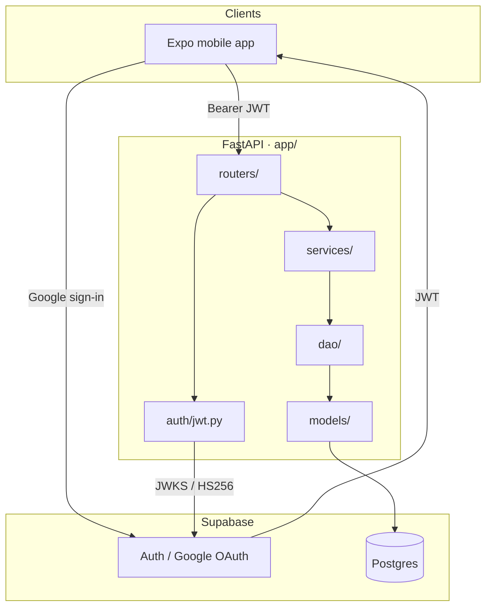
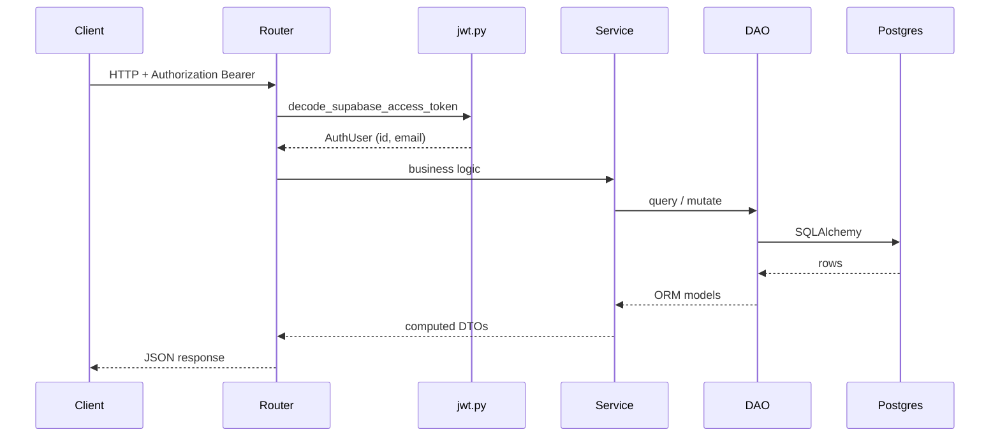
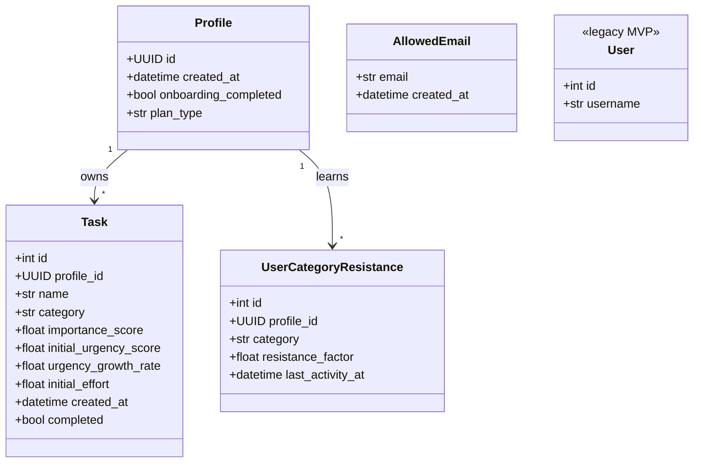
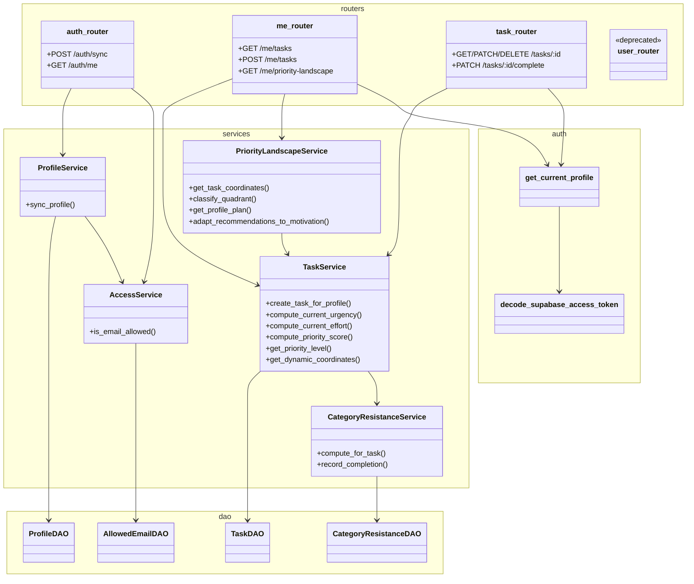
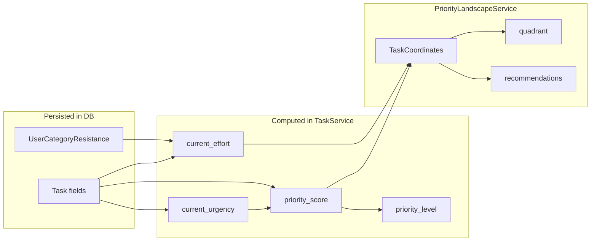

# Ike — Backend Architecture

FastAPI service backed by Supabase Postgres. Auth is delegated to **Supabase Google OAuth**; the API verifies JWTs and owns all task logic.

---

## Layer overview

---

## Request flow (authenticated)

---

## Class diagram (domain model)

---

## Class diagram (application layers)

---

## API surface (current)

| Router | Prefix | Auth | Purpose |
|--------|--------|------|---------|
| `auth_router` | `/auth` | Bearer (sync) | Profile sync after login, optional allowlist |
| `me_router` | `/me` | Profile | CRUD-ish task list, create, landscape plan |
| `task_router` | `/tasks` | Profile | Single-task get/update/complete/delete |
| `user_router` | `/users` | Mixed | Legacy integer-user routes (deprecated) |

---

## Dynamic scoring ownership

Nothing in the **runtime** or **landscape** groups is written back to Postgres during normal reads — only task CRUD and completion update stored state.

---

## External dependencies

| Component | Role |
|-----------|------|
| **Supabase Auth** | Google OAuth, session JWTs |
| **Supabase Postgres** | `profiles`, `tasks`, `allowed_emails`, `user_category_resistance` |
| **SQLAlchemy** | ORM + connection pool (`DATABASE_URL`) |
| **PyJWT + JWKS** | Verify ES256 / HS256 Supabase tokens |
