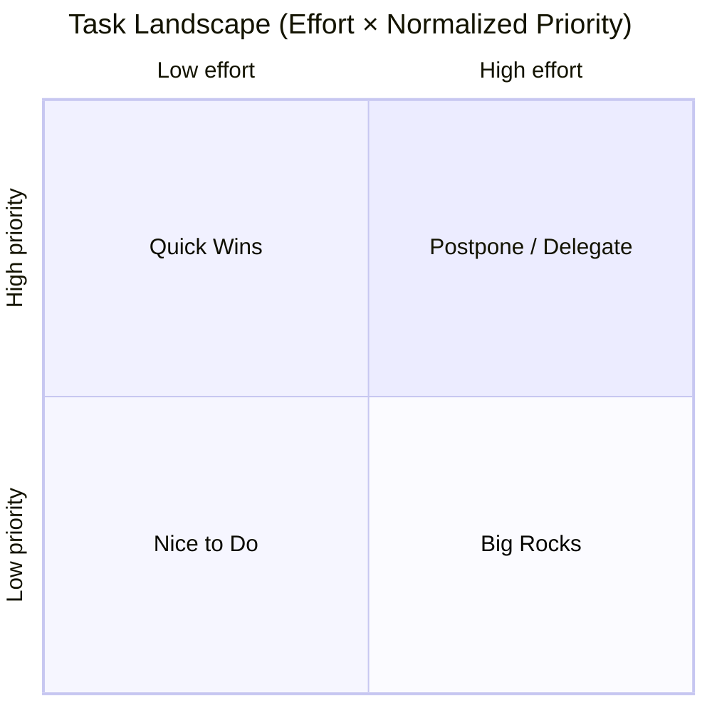
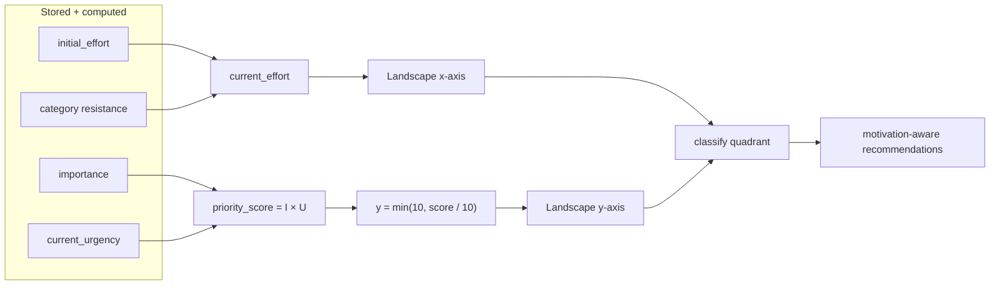
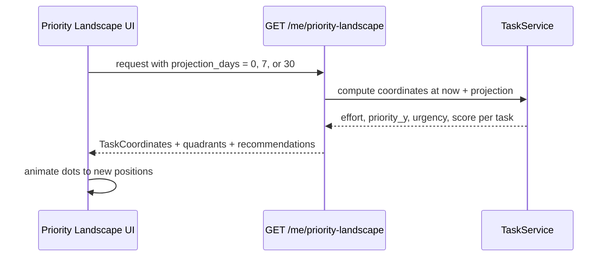

# Ike — Dynamic Priority Landscape

Ike uses **two related 2D views** of the same underlying tasks. Both are dynamic: as time passes, urgency (and therefore priority) increases, so dots **move** on refresh or projection.

---

## 1. Conceptual plane — Importance × Urgency

This is the core mental model: each task is a point whose **horizontal position is urgency** and **vertical position is importance**.  
Urgency is the only axis that **drifts over time** (to the right). Importance stays fixed unless the user edits the task.

```mermaid
flowchart TB
    subgraph plane ["Importance × Urgency plane (0–10 each axis)"]
        direction TB

        subgraph top [" "]
            direction LR
            NW[" "] --- NE["🔴 Critical zone<br/>(high importance<br/>+ high urgency)"]
        end

        subgraph mid [" "]
            direction LR
            SW[" "] --- SE[" "]
        end

        YHIGH["Importance ↑"] --- plane
        X["Urgency →"] --- SE

        NOTE["Over time: dots slide right →<br/>priority_score = importance × urgency"]
    end

    subgraph motion [Temporal drift]
        T0["Day 0 · dot at (urgency₀, importance)"]
        T1["Day N · dot at (urgency₀ + rate×N, importance)<br/>capped at urgency = 10"]
        T0 --> T1
    end

    plane --> motion
```

### Priority score on this plane

| Score | Level | Color |
|-------|-------|-------|
| &lt; 25 | Low | Green |
| 25 – 49 | Medium | Yellow |
| 50 – 74 | High | Orange |
| ≥ 75 | Critical | Red |

Dot color in the app follows `priority_score = importance × current_urgency`, not raw axis position alone.

---

## 2. App landscape — Effort × Normalized Priority

The **Priority Landscape** screen plots tasks on a different but complementary grid used for daily decisions and motivation-aware recommendations.



| Quadrant | Effort | Priority (y) | Meaning |
|----------|--------|--------------|---------|
| **Quick Wins** | &lt; 5 | ≥ 5 | High impact, low friction — do first when tired |
| **Big Rocks** | ≥ 5 | ≥ 5 | Important and heavy — schedule when motivated |
| **Nice to Do** | &lt; 5 | &lt; 5 | Low urgency/importance combo — backlog |
| **Postpone / Delegate** | ≥ 5 | &lt; 5 | Costly but not worth it now — defer or hand off |

Threshold for both axes: **5.0** (see `PriorityLandscapeService.classify_quadrant`).

### Axis mapping (code)



### Motivation filter (frontend + API)

| Motivation (1–10) | Emphasized quadrant |
|-------------------|---------------------|
| 1 – 4 | Quick Wins |
| 5 – 7 | Top tasks by score (balanced) |
| 8 – 10 | Big Rocks |

---

## 3. Animated projection (time preview)

The landscape supports projecting tasks **N days ahead** without persisting future state:



Projection recomputes `current_urgency`, `current_effort`, and `priority_score` using a **virtual “now”** in the future, so users can see which tasks will drift toward the critical zone.
