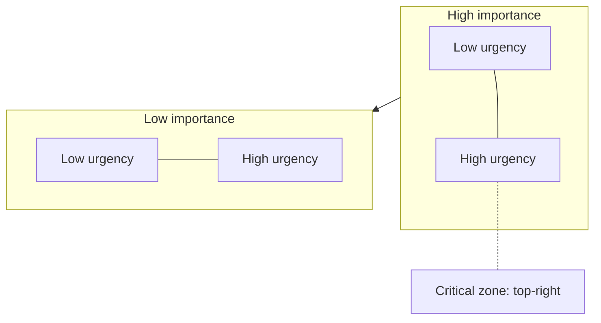
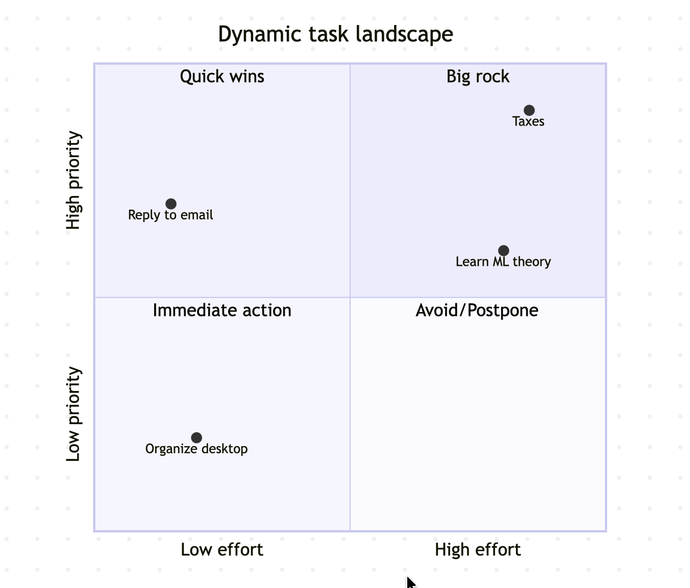
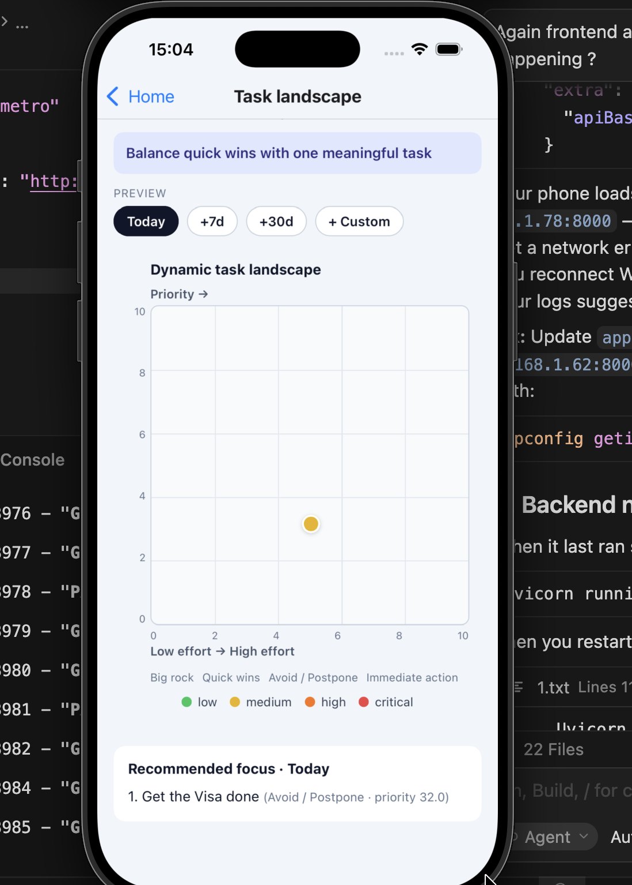
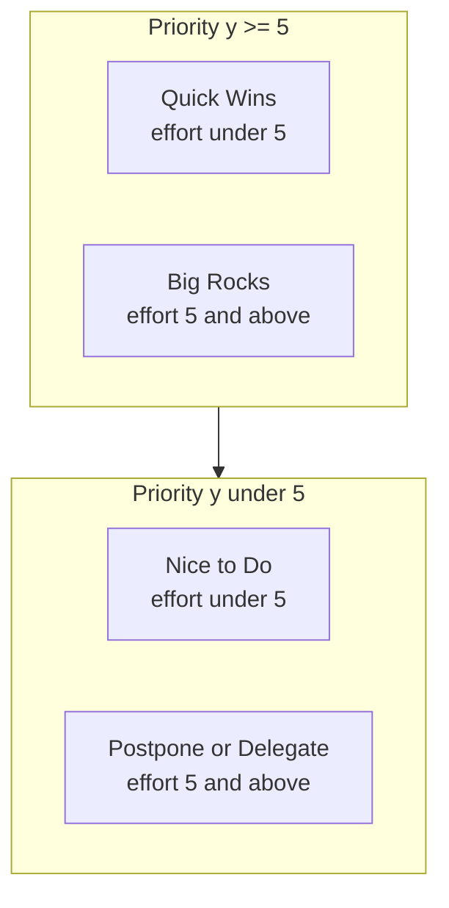
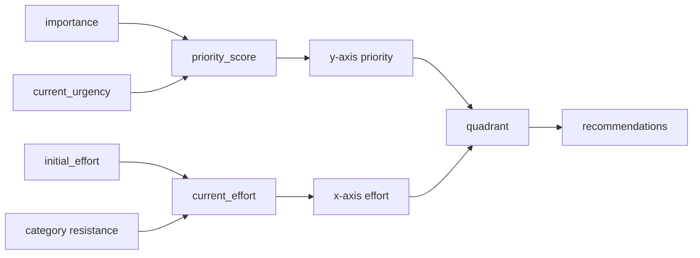
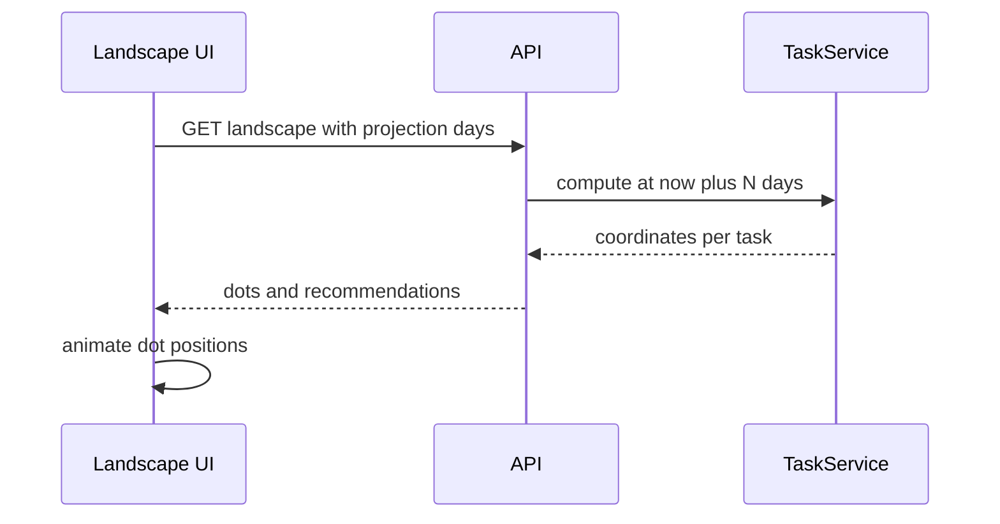

# Ike — Dynamic Priority Landscape

Ike uses **two related 2D views** of the same tasks. As time passes, urgency grows and dots **move** on refresh or when projecting ahead.

---

## 1. Conceptual plane — Importance x Urgency

Each task is a point on a 0–10 grid:

- **X-axis** = current urgency (grows over time, capped at 10)
- **Y-axis** = importance (fixed unless the user edits the task)

**Over time:** dots slide **right** along their row (urgency increases).

**Score:** `priority_score = importance * current_urgency` (range 0–100)

| Score | Level | Color |
|-------|-------|-------|
| under 25 | Low | Green |
| 25 to 49 | Medium | Yellow |
| 50 to 74 | High | Orange |
| 75 and above | Critical | Red |

---

## 2. App landscape — Effort x Priority

The **Priority Landscape** screen maps each task using computed values:

- **X-axis** = `current_effort` (0–10)
- **Y-axis** = normalized priority `min(10, priority_score / 10)`

Split at **5.0** on both axes:

| Quadrant | Effort | Priority | When to use |
|----------|--------|----------|-------------|
| Quick Wins | under 5 | 5 and above | High impact, low friction |
| Big Rocks | 5 and above | 5 and above | Important but heavy |
| Nice to Do | under 5 | under 5 | Backlog |
| Postpone / Delegate | 5 and above | under 5 | Defer or hand off |

---

## 3. How axes are computed

Formulas:

- `current_urgency = min(10, initial + growth_rate * days)`
- `priority_score = importance * current_urgency`
- `y = min(10, priority_score / 10)`
- `current_effort = min(10, initial_effort + resistance * sqrt(days))`

---

## 4. Motivation filter

| Motivation (1–10) | Emphasized quadrant |
|-------------------|---------------------|
| 1 to 4 | Quick Wins |
| 5 to 7 | Top tasks by score |
| 8 to 10 | Big Rocks |

---

## 5. Time projection

Projection recomputes urgency, effort, and score using a **future timestamp** — nothing is saved to the database.
